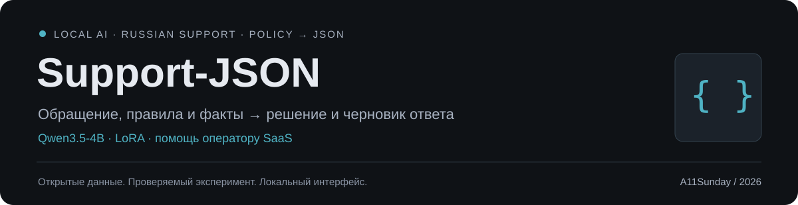
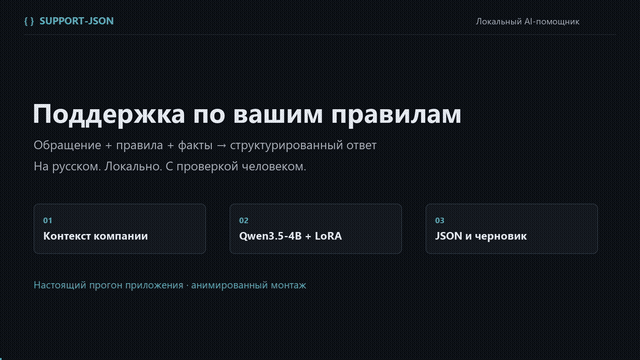

# Support-JSON

Локальный AI-помощник поддержки SaaS. Разбирает обращения по правилам компании и готовит решение с черновиком ответа на русском. В основе Qwen3.5-4B с LoRA.

[Модель на Hugging Face](https://huggingface.co/A11Sunday/support-json-qwen3.5-4b-lora) · [Датасет](https://huggingface.co/datasets/A11Sunday/support-json-ru) · [Результаты](RESULTS.md)

[](https://huggingface.co/A11Sunday/support-json-qwen3.5-4b-lora/resolve/main/assets/demo.mp4)

## Как работает

Передайте обращение, правила компании и известные факты. Для каждого факта можно указать источник: слова клиента или подтверждение системы. Если значение неизвестно, используйте `null`. Правила передаются с каждым запросом.

Модель возвращает JSON с девятью полями:

| Поле | Что в нём |
|---|---|
| `category` | Категория обращения |
| `priority` | Приоритет: low, medium, high или critical |
| `sentiment` | Настроение клиента |
| `action` | Ответить, уточнить, предложить действие или передать человеку |
| `recommended_action` | Конкретное следующее действие |
| `reply` | Черновик ответа |
| `missing_info` | Каких сведений не хватает |
| `supported_rule_ids` | На какие правила опирается решение |
| `human_escalation` | Нужен ли человек |

В интерфейсе можно менять правила и факты, смотреть JSON и копировать ответ. Приложение проверяет структуру результата и согласованность полей. Ответ перед отправкой проверяет оператор. Возвраты, отмены и изменения аккаунта он выполняет сам.

## Результаты

Обучены три версии LoRA. По validation выбрана версия на 512 примерах, обученная за две эпохи. Затем базовая модель и LoRA проверены на одних и тех же 108 синтетических test-обращениях с одинаковыми инструкциями и настройками.

| Метрика | Base | LoRA |
|---|---:|---:|
| Категория | 76,9% | 100,0% |
| Приоритет | 72,2% | 99,1% |
| Правильное действие | 27,8% | 89,8% |
| Валидная схема и согласованные поля | 54,6% | 95,4% |

Первые три строки оценивают отдельные поля. Если считать весь невалидный результат ошибкой, точность действия составляет 24,1% у base и 86,1% у LoRA. Подробности и исходные прогнозы есть в [описании оценки](docs/EVALUATION.md).

Текст ответов проверен отдельно на 36 парах. AI-оценщик поставил среднюю оценку 2,78 базовой модели и 4,31 LoRA из пяти. Ошибочные утверждения найдены в 13 ответах base и 5 ответах LoRA. Независимой человеческой оценки пока нет. [Разбор ошибок](reports/error-analysis-final.md).

## Запуск

Проверено на Windows с Python 3.12, RTX 5070 Ti 16 GB и CUDA 12.8. Для этой версии нужен NVIDIA GPU с CUDA. Базовые веса занимают около 9,3 GB на диске, адаптер около 130 MB. Также понадобится место для окружения и загрузок.

[Скачайте проект с адаптером](https://huggingface.co/A11Sunday/support-json-qwen3.5-4b-lora/resolve/main/artifacts/Support_JSON_Capstone-v3.zip), распакуйте его и откройте терминал в корне папки:

```powershell
python -m venv .venv
.\.venv\Scripts\python.exe -m pip install torch==2.11.0+cu128 --index-url https://download.pytorch.org/whl/cu128
.\.venv\Scripts\python.exe -m pip install -r requirements.inference.txt
.\.venv\Scripts\python.exe -m pip install -e .
.\.venv\Scripts\python.exe -X utf8 scripts/download_weights.py
.\.venv\Scripts\python.exe -X utf8 -m support_json.demo --adapter output/model/support-json-qwen3.5-4b-lora
```

Откройте http://127.0.0.1:7860. Выберите пример или добавьте своё обращение, проверьте контекст и нажмите «Разобрать обращение». Первый запрос загружает модель. Остановить сервер можно через `Ctrl+C`.

Запуск без полного архива описан в [карточке модели](https://huggingface.co/A11Sunday/support-json-qwen3.5-4b-lora#run-locally). При клонировании этого GitHub-репозитория адаптер нужно скачать отдельно с Hugging Face.

## Датасет

Данные синтетические. Решения размечены программно по условиям правил. Чужие переписки и внешние датасеты в обучение не включались.

| Версия | Train | Validation | Test | Для чего |
|---|---:|---:|---:|---|
| `selected` | 512 | 96 | 108 | Итоговая LoRA |
| `pilot` | 192 | 96 | 108 | Первый эксперимент |
| `expanded_trained` | 1 024 | Нет | Нет | Второй эксперимент |
| `expanded_candidates` | 10 000 | Нет | Нет | Дополнительные кандидаты |

Все 10 000 кандидатов не использовались для обучения итоговой модели. Версии пересекаются, поэтому их нельзя просто объединять как независимые примеры. Test не использовался для выбора адаптера. Для следующей версии нужен новый закрытый test.

Установите `datasets`, затем загрузите нужную версию:

```python
from datasets import load_dataset

ds = load_dataset("A11Sunday/support-json-ru", "selected")
print(ds)
```

В `messages` уже собраны system, user и assistant сообщения для обучения. Колонки `*_json` сохраняют исходные типы значений. Метаданные разметки не передаются модели.

[Подготовка данных](docs/DATASET.md) · [Расширение](docs/DATASET_EXPANSION.md) · [Описание на Hugging Face](https://huggingface.co/datasets/A11Sunday/support-json-ru)

## Обучение

Используется Soup с Transformers, PEFT и Liger. Итоговый запуск: BF16 LoRA, r=16, alpha=32, learning rate 1e-4, длина контекста 2048, loss только на ответе модели, seed 42.

Конфигурация лежит в `configs/soup-diverse-512.yaml`, отчёт в `reports/training-diverse-v5.json`. [Настройка окружения и первый запуск](docs/FIRST_RUN.md) · [Работа с Soup](docs/SOUP_PRACTICE.md).

## Ограничения

Модель ошибается в фактах и трактовке правил даже при корректном JSON. Небольшой синтетический тест не доказывает, что она справится с любыми компаниями. История переписки поддерживается на входе, но обучающие истории пустые, поэтому работа с многоходовыми диалогами требует отдельной проверки.

RAG и интеграции с системами компании пока не подключены. Устойчивость к prompt injection полностью не проверена. Экономия времени операторов в реальной работе не измерялась.

## Лицензии

Код и адаптер: [Apache-2.0](LICENSE). Датасет: [CC BY 4.0](LICENSE.dataset.txt). Автор: A11Sunday, 2026. Уведомления о базовой модели и шрифтах сохранены в [NOTICE](NOTICE).
